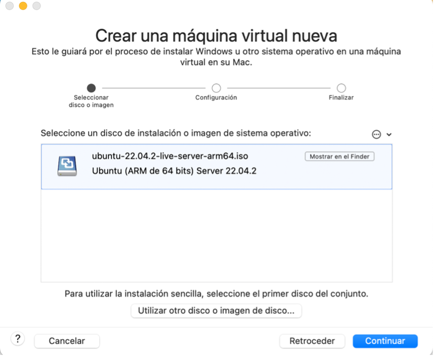
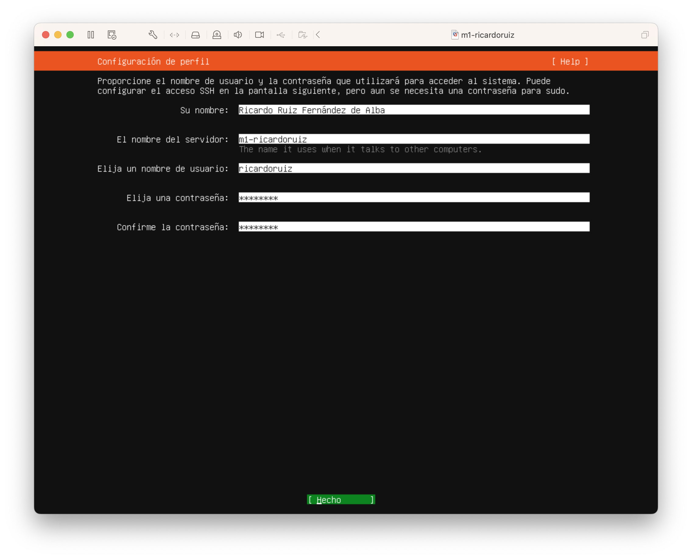
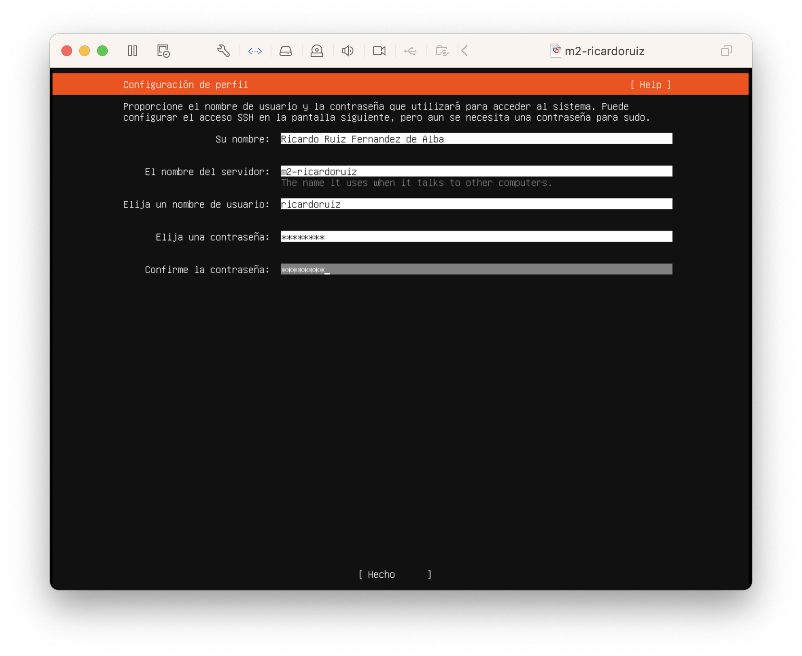
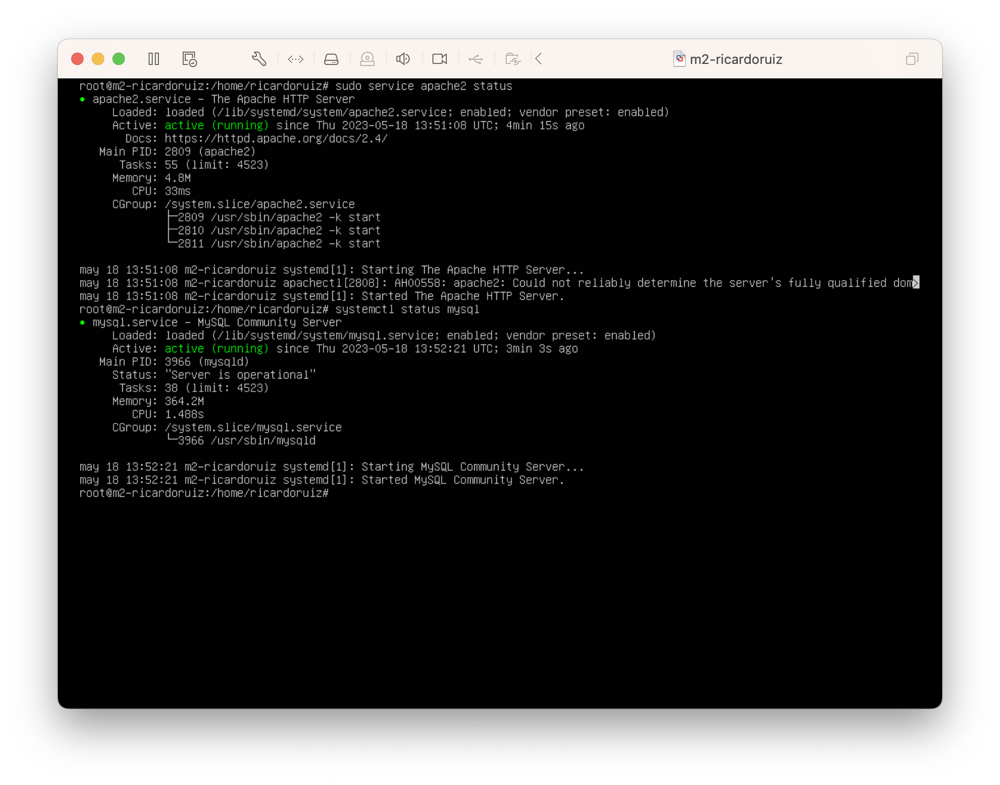
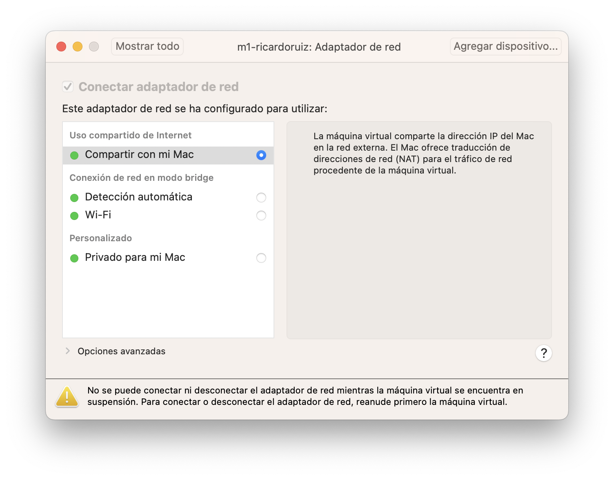
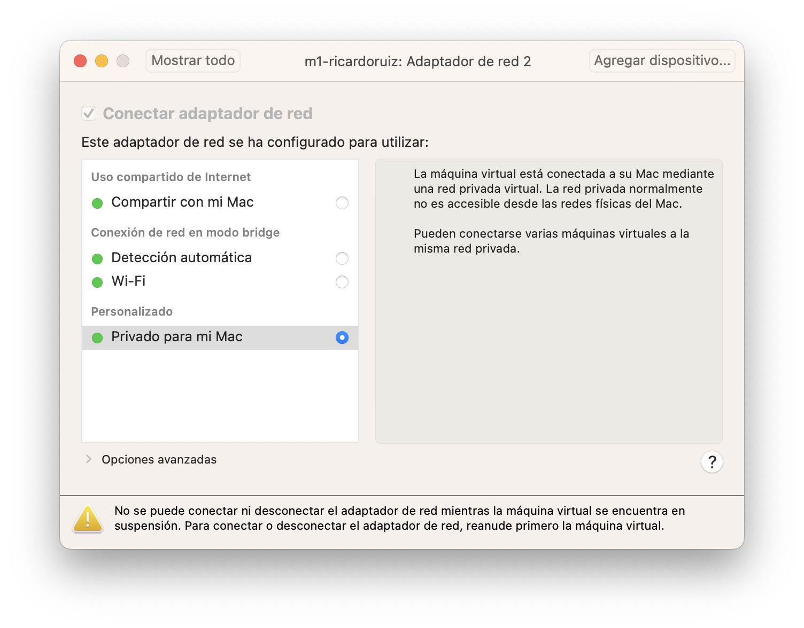

# Introducción

## Software de Virtualización

Utilizaremos VMWare Fusion para virtualizar varias máquinas con Ubuntu 22.04 LTS
que configuraremos para ir definiendo la estructura de granja web. Descargamos
Ubuntu 22.04 LTS con arquitectura ARM pues trabajamos desde MacOS Ventura con Apple Silicon M2.

La nombramos m1-ricardoruiz. La máquina se ha instalado con una configuración de
4GB de RAM y 20GB de disco duro. Modificamos el tamaño del disco duro a 10GB
mediante 

- Máquina Virtual > Disco duro NVMe > Configuración de Disco Duro (NVMe).


Iniciamos el programa y creamos una nueva máquina virtual con Inicio > Nuevo.
Pulsamos en instalar desde disco o imagen y seleccionamos la imagen descargada.




## Instalación de Ubuntu Server

1. Iniciamos la máquina virtual y procedemos a instalar Ubuntu Server.  
2. Arrancamos con Install Ubuntu Server e iniciamos en español.
3. En la configuración de perfil añadimos el nombre:
   1. Ricardo Ruiz Fernández de Alba
   2. Nombre de servidor m1-ricardoruiz
   3. Usuario: ricardoruiz
   4. Contraseña: Swap1234



Pulsamos la opcion de instalar OpenSSH. Repetimos la misma instalación con la máquina m2-ricardoruiz.




Las direcciones IP de las máquinas son:

- m1-ricardoruiz: 172.16.21.132
- m2-ricardoruiz: 172.16.21.130


## Tareas a realizar

Necesitamos efectuar las siguientes tareas.

1. Acceder por ssh de una máquina a otra
2. Acceder mediante la herramienta curl desde una máquina a la otra
3. Mostrar configuraciones de red y opciones de netplan
4. Crear web básica (swap.html) y mostrar funcionamiento de las máquinas M1 y M2


En primerl ugar realizaremos una instalación de Apache + PHP + MySQL (LAMP) en ambas máquinas


# Tarea1. Acceder por ssh de M1 a M2


## Instalación de SSH Server y SSH Cliente B.

fdsafdsaafs

## Configuración Avanzada de SSH Server y SSH Cliente

fdsafsdfsa

### Acceso sin Contraseña

fdsafdsafds

### Autenticación de Clave Pública y Privada

fdsafsafsa


### Uso de Comandos Avanzados de SSH Cliente

fdsafsdafsa

## Configuración Básica de SSH Server y SSH Cliente

fdsafdsadfsa

### Cambio de Puerto

fdsafdsaf

### Uso de Comandos Básicos de SSH Cliente

fdsafasd


Instalamos Apache y Mysql mediante los siguientes comandos:

```shell
$ sudo apt install apache2 mysql-server mysql-client
```

Comprobamos la versión:
```shell
$ apache2 -v
Server version: Apache/2.4.52 (Ubuntu)
Server built: 2023-03-01T22:43:55
```

Y lo iniciamos mediante

```shell
$ sudo systemctl enable apache2
$ sudo systemctl start apache2
```

Y comprobamos que los dos servicios están activos:




### Configuración Avanzada de Apache

#### Creación de Directorios Virtuales

#### Redirección de Puertos


# Instalación y Configuración de Servicios Apache


# Añadir y Configurar Adaptadores de Red

## Añadir Adaptadores de Red

Añadimos dos adaptadores de red en VMWare Fusion, uno de tipo **Uso compartido de Internet** que corresponde a modo NAT y otro Personalizado de tipo **Privado para mi mac**.





## Configuración de IP y Puertas de enlace

Abrimos el archivo de configuración de Netplan `/etc/netplan/00-installer-config.yaml` y lo editamos con la siguiente configuración:

```yaml
   network:
     version: 2
     renderer: networkd
     ethernets:
       ens160:
         addresses:
           - 192.168.1.10/24
         gateway4: 192.168.1.1
         nameservers:
           addresses: [8.8.8.8, 8.8.4.4]
       ens256:
         addresses:
           - 10.0.0.10/24
```

Así la interfaz `ens160` correspondiente al adaptador en modo NAT se configura con una dirección ip estática (`192.168.1.10/24`), una puerta de enlace (`192.168.1.1`) y servidores DNS. Por otro lado la interfaz "ens256" correspondiente al adptador en modo host-only sólo se configura con una dirección IP estática (`10.0.0.10/24`).

Aplicamos la configuración de Netplan con

```shell
$ sudo netplan generate
$ sudo netplan apply
```

Y verificamos que las interfaces de red tienen la configuración correcta con `ip addr show`.

## Configuración Avanzada de los Adaptadores

fsafdsa

### Configuración de Direcciones Estáticas

fdsafdaf

### Configuración de DHCP

fdsafads

### Configuración de Máscara de Red

fdsafdsa


### Configuración Básica por Defecto

fsafdsa


## Configuración Básica de Apache

### Cambio de Puertos


### Directorio WWW


### Verificación del Estado


# Tarea 3 Instalación y Uso de cURL


## Instalación de cURL

fdsafafds

## Uso Avanzado de cURL

fdsafdsafsa

### Opciones Avanzadas para HTTP: Cookies, Peticiones GET/POST, Puertos

fsafsdaf

## Uso Básico de cURL

fdsafdsaf

### Opciones Básicas para HTTP: -o, -0


fdsafdsa

### Verificación del Estado de la Instalación

fdsafdsaf


fdsafdsafsd


# Conclusiones

fdsafdsa
# Referencias
