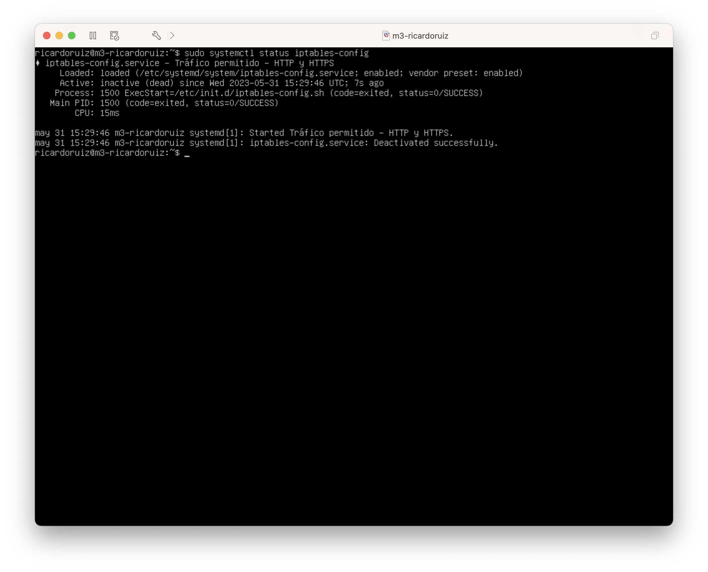

# Introducción

Un certificado SSL garantiza la seguridad de un sitio web y transmite confianza a los visitantes al afirmar que el sitio es auténtico y confiable para ingresar datos personales. El protocolo SSL es una capa de seguridad que se sitúa sobre TCP/IP y proporciona comunicación segura entre el cliente y el servidor. Ofrece autenticación mediante certificados, integridad mediante firmas digitales y privacidad a través de encriptación.

La versión actual, SSLv3, se considera insegura, y el nuevo estándar es TLS (Transport Layer Security). Hay diferentes formas de obtener un certificado SSL e instalarlo en un servidor web para utilizar el protocolo HTTPS:

- Autoridad de certificación
- Certificados auto-firmados
- Certbot (antes Let's Encrypt)

# Tareas

## Tareas básicas.

1. Crear e instalar en la máquina M1 un certificado SSL autofirmado para configurar el acceso HTTPS al servidor. Se debe comprobar que el servidor acepta tanto el tráfico HTTP como el HTTPS.

2. Copiar al resto de máquinas servidoras (M2) y al balanceador de carga (M3) el certificado autofirmado creado en M1 (archivos .crt y .key) y configurarlas para
que acepten tráfico HTTP y HTTPS.

3. Denegar todo el tráfico entrante a las máquinas M1, M2 y M3 a excepción de tráfico HTTP y HTTPS.

4. Configurar y documentar las reglas del cortafuegos con IPTABLES a través de un script en cada máquina con las reglas creadas.

\newpage

## Tareas avanzadas.

1. Permitir SSH, PING y DNS a las máquinas M1, M2 y M3 así como el tráfico consigo misma (localhost). El resto de servicios y/o peticiones debe denegarse.

2. Configurar M3 estableciendo reglas de iptables para que sólo M3 sea quien acepte peticiones HTTP y HTTPS mientras que M1 y M2 no acepten peticiones a no ser que sean peticiones provenientes de M3.

3. Hacer que la configuración del cortafuegos se ejecute al arranque del sistema en todas las máquinas.

4. Adicional: Crear, instalar y configurar un certificado SSL con Cerbot u otro


# Tarea 1. Certificado SSL en M1.

En la siguiente tarea, generaremos e instalaremos un certificado autofirmado:

Para generar un certificado SSL autofirmado en Ubuntu Server solo debemos
activar el módulo SSL de Apache, generar los certificados e indicarle la ruta a
los certificados en la configuración. Así pues, como root ejecutaremos en la
máquina M1:

```bash
ricardoruiz@m1-ricardoruiz $ su
root@m1-ricardoruiz:~# a2enmod ssl
root@m1-ricardoruiz:~# sudo service apache2 restart
root@m1-ricardoruiz:~# mkdir /etc/apache2/ssl
root@m1-ricardoruiz:~# openssl req -x509 -nodes -days 365 -newkey rsa:2048 -keyout /etc/apache2/ssl/apache.key -out /etc/apache2/ssl/apache.crt
```

E ingresamos la siguiente información personal en el certificado:


Modificamos la ruta de los certificados en la configuración de Apache:

```bash
ricardoruiz@m1-ricardoruiz $ sudo mv /etc/apache2/ssl/apache.crt /etc/apache2/ssl/swap_ricardoruiz.ssl
ricardoruiz@m1-ricardoruiz $ sudo mv /etc/apache2/ssl/apache.key /etc/apache2/ssl/swap_ricardoruiz.key
```

Y editamos el archivo de configuración del sitio default-ssl: nano
`/etc/apache2/sites-available/default-ssl.conf`

Agregamos la ruta de los certificados debajo del parámetro SSLEngine on:

```conf
[...]
SSLEngine on
SSLCertificateFile /etc/apache2/ssl/swap_ricardoruiz.crt
SSLCertificateKeyFile /etc/apache2/ssl/swap_ricardoruiz.key
```


Activamos el sitio **default-ssl** y reiniciamos apache:

```bash
ricardoruiz@m1-ricardoruiz $ sudo a2ensite default-ssl 
ricardoruiz@m1-ricardoruiz $ sudo service apache2 reload
```

Podemos acceder ahora al servidor web mediante el protocolo HTTPS y veremos que
en la barra de dirección sale en rojo el https, ya que se trata de un
certificado autofirmado.


Igualmente podemos realizar las peticiones con curl

```bash
ricardoruiz@m1-ricardoruiz $ curl -k https://172.16.21.132/swap.html
```

# Tarea 2. Certificado SSL en M2 y M3.

Queremos que la granja nos permita usar el HTTPS por lo que configuraremos el 
balanceador para que también lo acepté. Copiaremos la pareja de archivo (.ssl, .key)
a todas las máquinas

Usaremos scp:

```bash
ricardoruiz@m1-ricardoruiz $ sudo cd /etc/apache2/ssl
ricardoruiz@m1-ricardoruiz $ sudo scp swap_ricardoruiz.crt ricardoruiz@192.168.2.20:/home/ricardoruiz
ricardoruiz@m1-ricardoruiz $ sudo scp swap_ricardoruiz.key ricardoruiz@192.168.2.20:/home/ricardoruiz
```

Y desde M2, activamos el módulo SSL:

```bash
ricardoruiz@m2-ricardoruiz $ sudo mkdir /etc/apache2/ssl
ricardoruiz@m2-ricardoruiz $ sudo mv swap_ricardoruiz.crt /etc/apache2/ssl
ricardoruiz@m2-ricardoruiz $ sudo mv swap_ricardoruiz.key /etc/apache2/sslede
ricardoruiz@m2-ricardoruiz $ sudo a2enmod ssl & sudo service apache2 restart
ricardoruiz@m2-ricardoruiz $ sudo nano /etc/apache2/sites-available/default-ssl.conf 
```

Realizamos la misma copia de la pareja de archivo en el balanceador (M3)
pero añadiendo esta vez al servidor nginx configurado en la práctica
anerior los siguiente: `/etc/nginx/conf.d/default.conf`:

```
listen 443 ssl;
ssl on;
ssl_certificate /home/ricardoruiz/ssl/swap_ricardoruiz.crt; 
ssl_certificate_key /home/ricardoruiz/ssl/swap_ricardoruiz.key;
```


Usando ufw activaremos el tráfico HTTPS en el balanceador:

```bash
ricardoruiz@m3-ricardoruiz $ sudo ufw allow "NGINX HTTPS"
```

Ahora ya podremos hacerle peticiones por HTTPS a la IP del balanceador, 
obteniendo como antes resultado en rojo en la barra de dirección:


# Tarea 3. Denegar todo el tráfico entrante a las máquinas M1, M2 y M3 a excepción de tráfico HTTP y HTTPS.

Un cortafuegos es un componente esencial que protege una granja web de accesos
indebidos. Actúa como un guardián de la puerta al sistema web, permitiendo el
tráfico autorizado y denegando el resto. En Linux, una herramienta comúnmente
utilizada para configurar un cortafuegos es iptables.

iptables es una herramienta de cortafuegos en el espacio de usuario que permite
al superusuario definir reglas de filtrado de paquetes, traducción de
direcciones de red y mantener registros de log. Está construida sobre Netfilter,
una parte del núcleo Linux que permite interceptar y manipular paquetes de red.

Queremos que el tráfico HTTP y HTTPS sea el único que pueda acceder a las
máquinas M1, M2 y M3. Para ello, crearemos un script que configure el
cortafuegos con iptables. El script se ejecutará al arrancar el sistema y
configurará el cortafuegos con las reglas que definamos.

\newpage

```bash
# (1) se eliminan todas las reglas que hubiera 
# para hacer la configuración limpia: 
iptables -F
iptables -X
# (2) establecer las políticas por defecto (denegar todo el tráfico): 
iptables -P INPUT DROP
iptables -P OUTPUT DROP
iptables -P FORWARD DROP
# (3) permitir cualquier acceso desde localhost (interface lo): 
iptables -A INPUT -i lo -j ACCEPT
iptables -A OUTPUT -o lo -j ACCEPT
# (4) únicamente se permitirá el tráfico HTTP (puerto 80) y HTTPS (puerto 443)
iptables -A INPUT -m state --state NEW -p tcp --dport 80 -j ACCEPT 
iptables -A INPUT -m state --state NEW -p tcp --dport 443 -j ACCEPT

```

Escribimos el siguiente script en `/etc/init.d/iptables.sh` y le damos
permisos de ejecución
    
```bash
ricardoruiz@m1-ricardoruiz $ sudo chmod +x /etc/init.d/iptables.sh
```

Y creamos un servicio para que se ejecute al arrancar el sistema:

```
sudo nano /etc/systemd/system/iptables-config.service

[Unit]
Description=Tráfico permito - HTTP y HTTPS
After=network.target

[Service]
ExecStart=/etc/init.d/iptables-config.sh
User=root

[Install]
WantedBy=multi-user.target
```

Establecemos los permisos adecuados y activamos el servicio:

```bash
ricardoruiz@m2-ricardoruiz $ sudo chmod 644 /etc/systemd/system/iptables-config.service
ricardoruiz@m1-ricardoruiz $ sudo systemctl daemon-reload
ricardoruiz@m1-ricardoruiz $ sudo systemctl enable iptables-config
```

Reiniciamos la máquina virtual y comprobamos que el servicio se ha ejecutado
correctamente:



Para comprobar el funcionamiento del cortafuegos recién configurado usaremos
la orden netstat para ver los puertos abiertos en la máquina:

Por ejemplo, para asegurarnos del estado (abierto/cerrado) del puerto 80, podemos ejecutar:

```
netstat -tulpn | grep :80
netstat -tulpn | grep :443
```

# Referencias